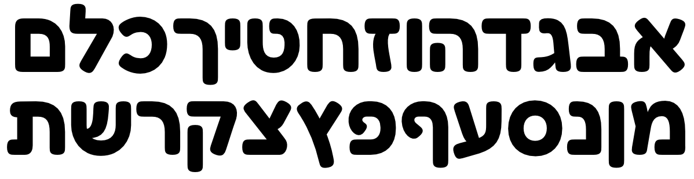

# Fredoka One

Fredoka One is a big, round, bold font that is perfect for adding a little fun to any headline or large text.

The initial Latin component was designed by <a href="mailto:milenabbrandao@gmail.com">Milena Brandão</a>.
The later Hebrew component was designed by Ben Nathan.

The Fredoka project is led by Ben Nathan, a typeer design foundry based in Israel. 
To contribute, see <a href="https://github.com/hafontia/Fredoka-One">github.com/hafontia/Fredoka-One</a>

